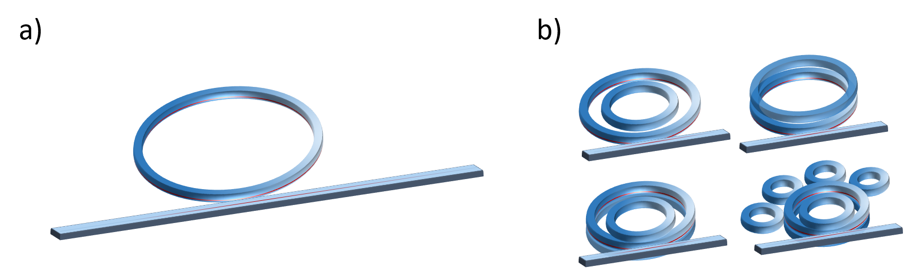
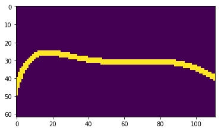
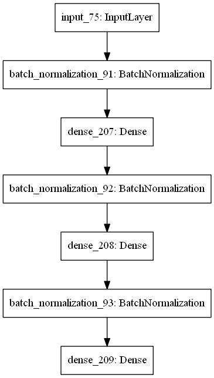
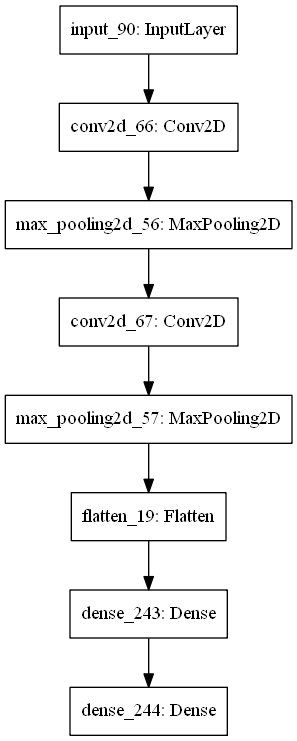
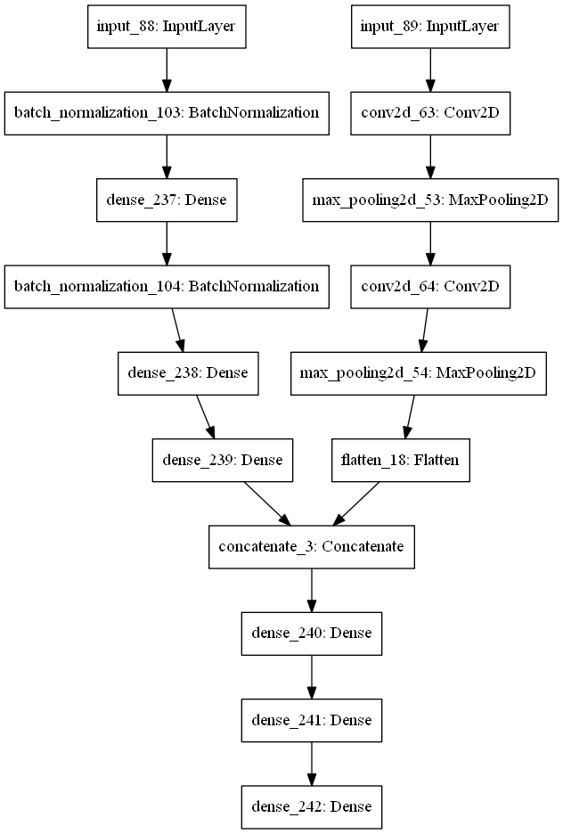
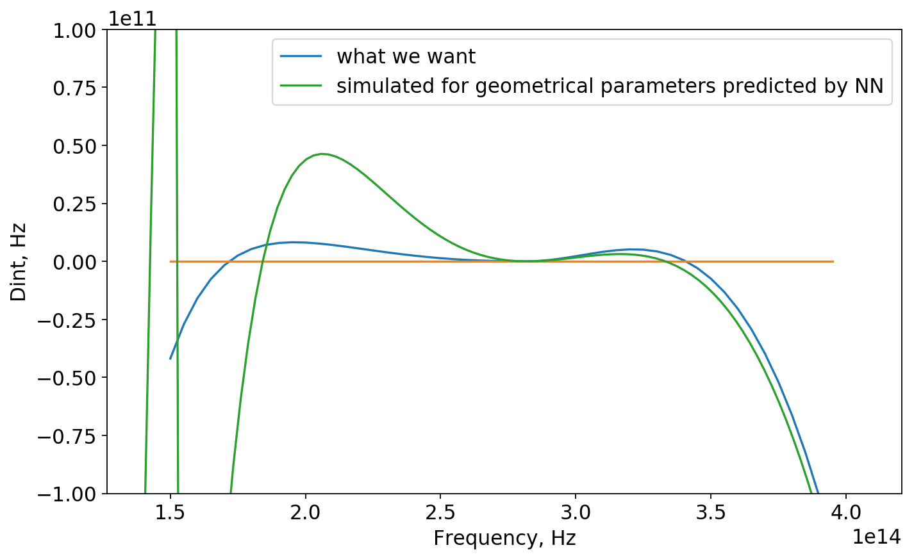
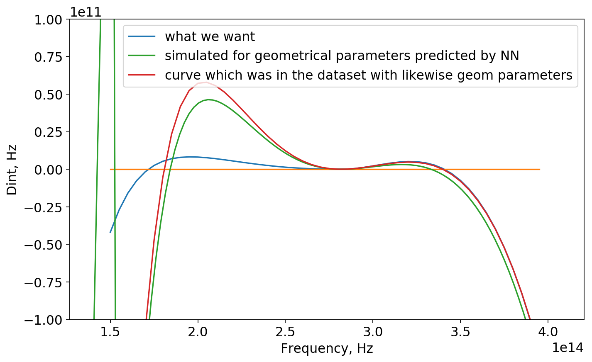

## Reverse Engineering in Dispersion Engineering

Prediction of geometrical parameters given a dispersion curve. 

### Description of the project

We aim for advanced dispersion engineering design of microresonators to achieve broad (ideally octave-spanning) frequency combs. 

Frequency comb is an array of equidistant spikes in frequency domain. Recently, FC were discovered in microresonators, where they can be generated due to the optical parametric oscillations, i.e four-wave mixing.


However, this nonlinear process requires high optical confinement of the light, so that non-linear processes can play a significant role, and an appropriate dispersion of the light modes in microresonator. The former can be obtained by increasing the Q-factor of the microresonator, while the latter one is a problem of dispersion engineering, where the geometry of the microresonator is designed in a special way to guide the light.


It appears that one of the key conditions for comb generation - is an anomalous dispersion (where the distance between two consecutive resonances of the resonator increases with increasing optical frequency, D2>0 (on the figures) ).

The dispersion profile (Dint vs frequency) determines the spectrum of the comb one can achieve in microresonator.


Generally, we want Dint (see figure above) to be slightly > 0 and very broad, thus the comb is flat and broad. If |Dint| is significantly more than 0, which means that the mode is far from the corresponding microresonator resonance, the comb substantially decays (see the figure above for example).

Conventional way to engineer dispersion is to play with geometrical parameters of the single waveguide.


However, this is already well established technique, which has already met its limit. New approaches has been proposed: combining several resonators to locally induce anomalous/normal dispersion thus extending overall Dint profile (see for example: [[Dispersion engineering and frequency comb generation in thin silicon nitride concentric microresonators](https://www.nature.com/articles/s41467-017-00491-x)]). 



Figure demonstates conventional (a) and advanced (b) resonator geometries.

The extension happens due to the mode hybridization between two resonators at a given range of frequencies, where one can effect the dispersion. The figure below represents the example of dispersion engineering with 2 concentric resonators. Red and pink Dint profiles correspond to resonators alone (when only one of them exists and is measured), while the blue profile refers to hybridised mode which exists only in the system of two resonators and propagates simultaneously in both of them.


On the figure above one can observe extension of the Dint (Mode deviation) profile, due to locally induced anomalous dispersion (around 220THz). For the red curve comb would vast until until 230 THz on the low frequency side, while for hybridized mode it would go 190 THz. For high frequencies red and blue curves are almost the same. 

Generally, to predict dispersion profile, one usually simulates distribution of eigenmodes in microresonator, which is done by solving system of Maxwell equations in commercial softwear like COMSOL or ANSYS (via Finite Elements Method). Combining two resonators already becomes hard problem as the number of geometrical parametters increases. Now one has: widths of 2 resonators, heights, gap distance and radius. One round of simulations takes about 10 min for quite sparse array of frrequencies taken to calculate modes at (we calculate modes in range from 180THz up to 380THz each 10Thz), (8 CPUs and many RAM).

Here one might think to apply some fancy algorithms to be able to predict parameters of the system, given the known dispersion curve. Our idea is to feed a Neural Network with simulated batch of data, so it is later able to map dispersion curve that we draw to real parameters of the microresonator.

Acquiring the data was the toughest challenge. One can estimate, that 10 mins/sample turns to be around 140 samples per day. Due to the license restrictions it is possible to use the softwear on one computer only. Also there is a tradeoff between quality of the data and quantity of the samples. Trying to get about **6000** samples we simulated quite sparse dispersion array which results in low precision.

One might think about optimization problem, where it is possible to assign kind off score of each dispersion curve based on its width and slight positive deviations from zero, or even multiple zero-crossings ([[which leads to dispersive waves](http://science.sciencemag.org/content/351/6271/357)]) and try to optimize it (where generative algorithms might be useful). But here we focus on a Neural Network implementation, eventhough it might be not optimal way to solve this sort of problem.

As an input for the network we use dispersion data and for the output - geometrical parameters, corresponding to this curve.

### Some details regarding the code

#### Downloading  dataset

```python
import pickle
## images data
with open('data/rede/raw/5070-62-111-images.pkl', 'rb') as f:
    img = pickle.load(f)

## vectors of Dispersion and frequency grid
with open('data/rede/raw/5070-frequencies_modes.pkl', 'rb') as f:
    Disp = pickle.load(f)    

## Geometrical parameters
with open('data/rede/raw/5070-5-parameters.pkl', 'rb') as f:
    parameters_list = pickle.load(f)
```

#### Preprocessing of raw data




To get processed data you can visit [[prepare_dataset_keras.ipynb](utils/prepare_dataset_keras.ipynb)].
(These 2 pictures correspond to differnt parameters).

#### NN implementation, visit [[main_keras_realization.ipynb](main_keras_realization.ipynb)]
* First, we feed our network with one-dimensional vectors of Dint corresponding to given frequencies (same for the whole vectors)



* Second, we implemented convolutional NN, where it is fed with images. 



* Third, we combined 2 networks. 


### Results
*PaboTaET }{yEBo*

1st NN performed best, with mse = 0.25;
Here are shown geometrical parameters(normalized) of test data, and ones predicted by NN.
```python
y_test[a]

array([[ 3.5 , 14.5 ,  7.5 ,  2.4 ,  8.  ],
       [ 3.  , 15.5 ,  7.6 ,  1.65,  9.6 ],
       [ 2.5 , 15.5 ,  6.4 ,  1.55,  9.6 ],
       [ 3.5 , 15.5 ,  8.  ,  2.2 ,  8.  ],
       [ 3.  , 15.5 ,  7.2 ,  1.55,  8.4 ],
       [ 3.5 , 15.5 ,  6.8 ,  1.55,  9.6 ],
       [ 3.  , 15.5 ,  8.5 ,  1.8 , 10.  ],
       [ 4.  , 15.  ,  6.  ,  1.75,  7.6 ],
       [ 2.5 , 14.5 ,  7.  ,  2.4 ,  8.4 ],
       [ 4.  , 14.5 ,  8.5 ,  1.9 , 10.  ]])
       
model.predict(X_test)[a]       

array([[ 3.3143342, 14.9358635,  7.576552 ,  1.9447037,  8.548236 ],
       [ 2.9594233, 14.9880295,  7.8288393,  1.9011168,  9.482163 ],
       [ 3.1460183, 15.228081 ,  7.058155 ,  1.9260627,  9.692702 ],
       [ 3.4182646, 15.498358 ,  7.0852118,  1.9343007,  8.853269 ],
       [ 3.3239105, 15.008889 ,  7.32713  ,  1.9090928,  8.689564 ],
       [ 3.0878284, 15.083664 ,  7.5174565,  1.9432529,  9.540515 ],
       [ 3.3618717, 15.127085 ,  8.252455 ,  1.8655368,  9.490334 ],
       [ 3.4425998, 15.472049 ,  7.1377964,  1.9095007,  8.77194  ],
       [ 3.243337 , 15.221086 ,  7.312777 ,  2.0029273,  8.727796 ],
       [ 2.924205 , 14.94679  ,  8.190481 ,  1.8111858,  9.131056 ]],
      dtype=float32)
```

Thus, we conclude that the perfomance of NN is not perfect.

Now, we check the perfomance of the NN asking it to predict geometrical parameters of the curve that was not in the dataset. Further we simulate those parameters in COMSOL and compare 2 results for dispersion.



There is something in that!

Now for predicted geonetrical parameters:
```python
array([[ 3.6425095, 15.237562 ,  7.285256 ,  2.1243105,  9.59958  ]],
      dtype=float32)
```
We find the sample in the dataset with likewise geometrical parameters:
```python
[3.5e-07 1.5e-06 7.5e-07 2.2e-05 9.6e-07]
```
And plot it (red curve):



Apparently, NN predicted geometrical parameters for blue curve (which was not in dataset for sure) similar to red one (evethough there still is difference). One could explain it as right parts of those curves almost correspond and NN found out that!

### Contributors
* Anton Lukashchuk &lt;[anton.lukashchuk@epfl.ch](mailto:anton.lukashchuk@epfl.ch)&gt;
* Anton Karazeev &lt;[anton.karazeev@phystech.edu](mailto:anton.karazeev@phystech.edu)&gt;
* Maxim Karpov &lt;[maxim.karpov@epfl.ch](mailto:maxim.karpov@epfl.ch)&gt;
