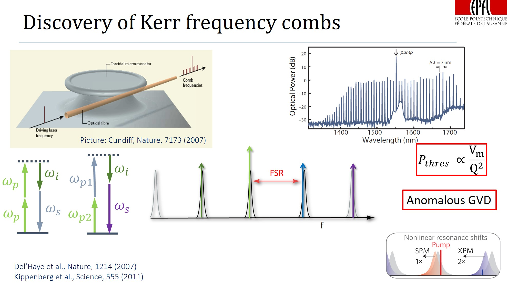
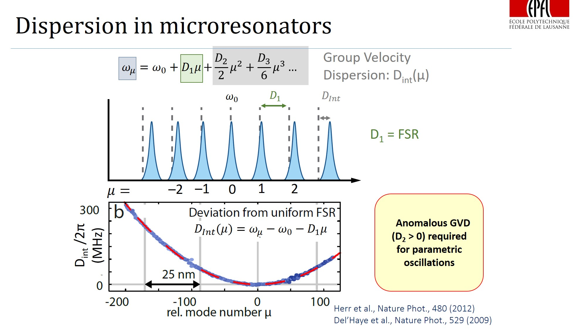
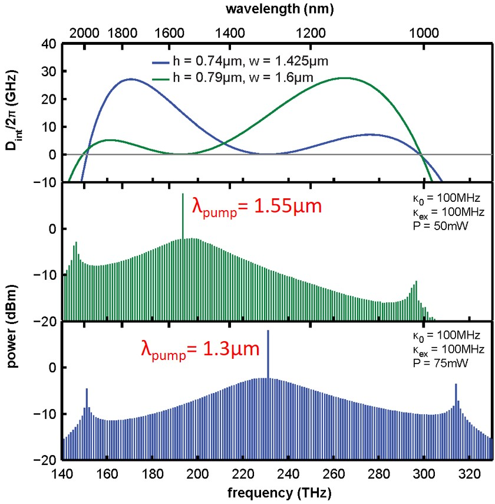
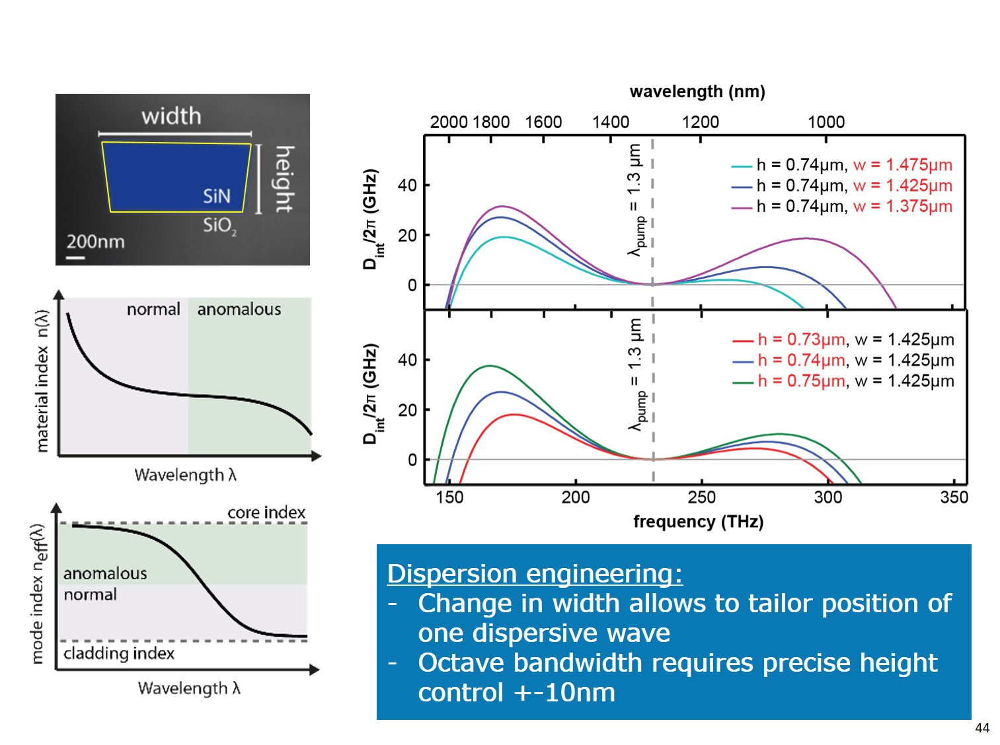
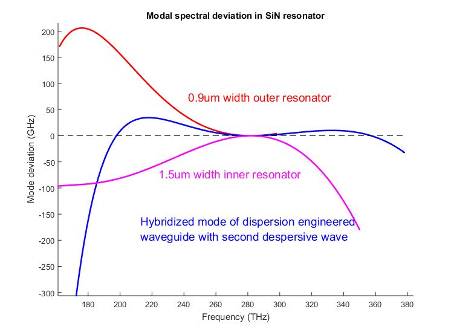
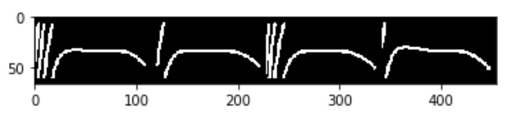

## Reverse Engineering in Dispersion Engineering

Prediction of geometrical parameters given a dispersion curve. 

### Description of the project

We aim for advanced dispersion engineering design of microresonators to achieve broad (ideally octave-spanning) frequency combs. 

Frequency comb is an array of equidistant spikes in frequency domain. Recently, FC were discovered in microresonators, where they can be generated due to the optical parametric oscillations, i.e four-wave mixing.



However, this nonlinear process requires high optical confinement of the light, so that non-linear processes can play a significant role, and an appropriate dispersion of the light modes in microresonator. The former can be obtained by increasing the Q-factor of the microresonator, while the latter one is a problem of dispersion engineering, where the geometry of the microresonator is designed in a special way to guide the light.



It appears that one of the key conditions for comb generation - is an anomalous dispersion (where the distance between two consecutive resonances of the resonator increases with increasing optical frequency, D2>0 (on the figures) ).

The dispersion profile (Dint vs frequency) determines the spectrum of the comb one can achieve in microresonator.



Generally, we want Dint (see figure above) to be slightly > 0 and very broad, thus the comb is flat and broad. If |Dint| is significantly nore than 0, which means that the mode is far from the corresponding microresonator resonance, the comb substantially decays.

Conventional way to engineer dispersion is to play with geometrical parameters of the single waveguide.



However, this is already well established technique, which has already met its limit. New approaches has been proposed: combining several resonators to locally induce anomalous/normal dispersion thus extending overall Dint profile (see for example: [[Dispersion engineering and frequency comb generation in thin silicon nitride concentric microresonators](https://www.nature.com/articles/s41467-017-00491-x)]). This happens due to the mode hybridization between two resonators at a given range of frequincie, where one can effect the dispersion. 



On the figure above one can observe extension of the Dint (Mode deviation) profile, due to locally induced anomalous dispersion (around 220THz). For the red curve comb would vast until until 230 THz on the low frequency side, while for hybridized mode it would go 190 THz. For high frequencies red and blue curves are almost the same. 

Generally, to predict dispersion profile, one usually simulates distribution of eigenmodes in microresonator, which is done by solving system of Maxwell equations in commercial softwear like COMSOL or ANSYS (via Finite Elements Method). Combining two resonators already becomes hard problem as the number of geometrical parametters increases. Now one has: widths of 2 resonators, heights, gap distance and radius. One round of simulations takes about 10 min for quite sparse array of frrequencies taken to calculate modes at (we calculate modes in range from 180THz up to 380THz each 10Thz), (8 CPUs and many RAM).

Here one might think to apply some fancy algorithms to be able to predict parameters of the system, given the known dispersion curve. Our idea is to feed a Neural Network with simulated batch of data, so it is later able to map dispersion curve that we draw to real parameters of the microresonator.

One might think about optimization problem, where it is possible to assign kind off score of each dispersion curve based on its width and slight positive deviations from zero, or even multiple zero-crossings [[which leads to dispersive waves] (http://science.sciencemag.org/content/351/6271/357)] and try to optimize it. But here we focus on a Neural Network implementation, eventhough it might be not optimal way to solve this sort of problem.

### Some details regarding the code


#### Downloading  dataset

```python
import pickle
## images data
with open('data/rede/raw/5070-62-111-images.pkl', 'rb') as f:
    img = pickle.load(f)

## vectors of Dispersion and frequency grid
with open('data/rede/raw/5070-frequencies_modes.pkl', 'rb') as f:
    Disp = pickle.load(f)    

## Geometrical parameters
with open('data/rede/raw/5070-5-parameters.pkl', 'rb') as f:
    parameters_list = pickle.load(f)
```

#### Image samples from dataset



And corresponding parameters of simulated models: (gap, width1, height, radius1, width2).
```
1.00000e-05 *
  0.0250  0.1550  0.0850  2.2000  0.0880
  0.0300  0.1450  0.0700  2.0000  0.0920
  0.0250  0.1550  0.0700  2.2000  0.0920
  0.0350  0.1500  0.0750  2.0000  0.1000
[torch.FloatTensor of size 4x5]
```

See [[main.ipynb](main.ipynb)] for more information.

#### Preprocessing of raw data


To get processed values you can visit [[dispersion_values.ipynb](utils/dispersion_values.ipynb)].

#### Contributors
* Anton Lukashchuk &lt;[anton.lukashchuk@epfl.ch](mailto:anton.lukashchuk@epfl.ch)&gt;
* Anton Karazeev &lt;[anton.karazeev@phystech.edu](mailto:anton.karazeev@phystech.edu)&gt;
* Maxim Karpov &lt;[maxim.karpov@epfl.ch](mailto:maxim.karpov@epfl.ch)&gt;
