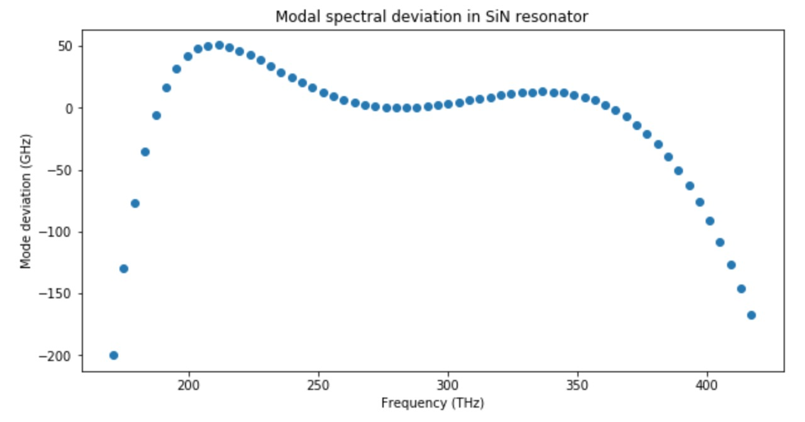

## Reverse Engineering in Dispersion Engineering

Prediction of simulation parameters.

### Description of the project

We aim for advanced dispersion engineering design of microresonators to achieve broad (ideally octave-spanning) frequency combs. 

Frequency comb is a array of equidistant spikes in frequency domain. Recently, FC were discovered in microresonators, where they can be generated due to the optical parametric oscillations, i.e four-wave mixing.


However, this nonlinear process requires high optical confinement of the light, so that non-linear processes can play a significant role, and an appropriate dispersion of the light modes in microresonator. The former can be obtained by increasing the Q-factor of the microresonator, while the latter one is a problem of dispersion engineering, where the geometry of the microresonator is designed in a special way to guide the light.


It appears that one of the key conditions for comb generation - is an anomalous dispersion (where the group velocity increases with increasing optical frequency, D2>0 (on the figures) ).

The dispersion profile (Dint vs frequency) determines the spectrum of the comb one can achieve in microresonator.


Conventional way to engineer dispersion is to play with geometrical parameters of the single waveguide.


### Some details regarding the code

#### Downloading  dataset

```python
import pickle
## images data
with open('data/rede/raw/5070-62-111-images.pkl', 'rb') as f:
    img = pickle.load(f)

## vectors of Dispersion and frequency grid
with open('data/rede/raw/5070-frequencies_modes.pkl', 'rb') as f:
    Disp = pickle.load(f)    

## Geometrical parameters
with open('data/rede/raw/5070-5-parameters.pkl', 'rb') as f:
    parameters_list = pickle.load(f)
```

#### Image samples from dataset


And corresponding parameters of simulated models: (gap, width1, height, radius1, width2).
```
1.00000e-05 *
  0.0250  0.1550  0.0850  2.2000  0.0880
  0.0300  0.1450  0.0700  2.0000  0.0920
  0.0250  0.1550  0.0700  2.2000  0.0920
  0.0350  0.1500  0.0750  2.0000  0.1000
[torch.FloatTensor of size 4x5]
```

See [[main.ipynb](main.ipynb)] for more information.

#### Preprocessing of raw data



To get processed values you can visit [[dispersion_values.ipynb](utils/dispersion_values.ipynb)].

#### Contributors
* Anton Lukashchuk &lt;[anton.lukashchuk@epfl.ch](mailto:anton.lukashchuk@epfl.ch)&gt;
* Anton Karazeev &lt;[anton.karazeev@phystech.edu](mailto:anton.karazeev@phystech.edu)&gt;
* Maxim Karpov &lt;[maxim.karpov@epfl.ch](mailto:maxim.karpov@epfl.ch)&gt;
